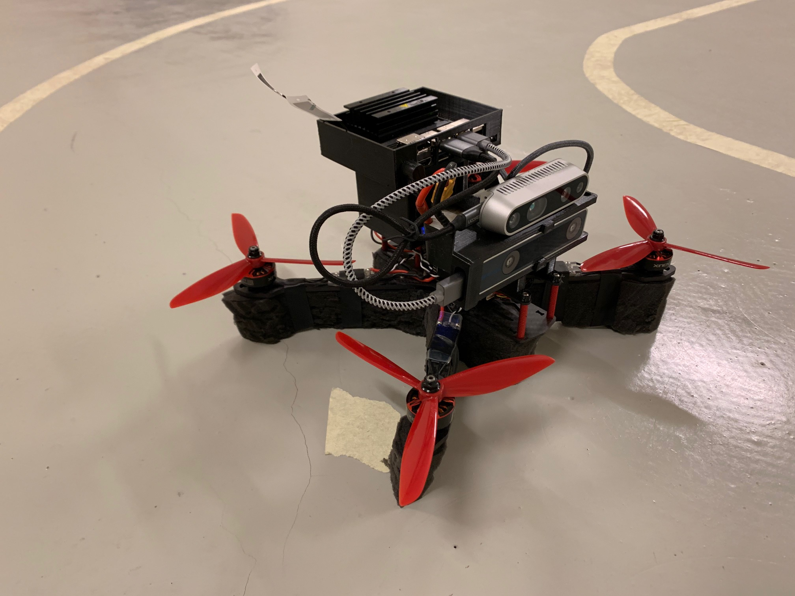
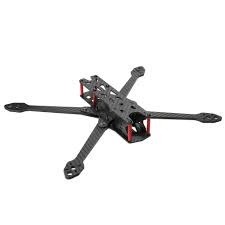
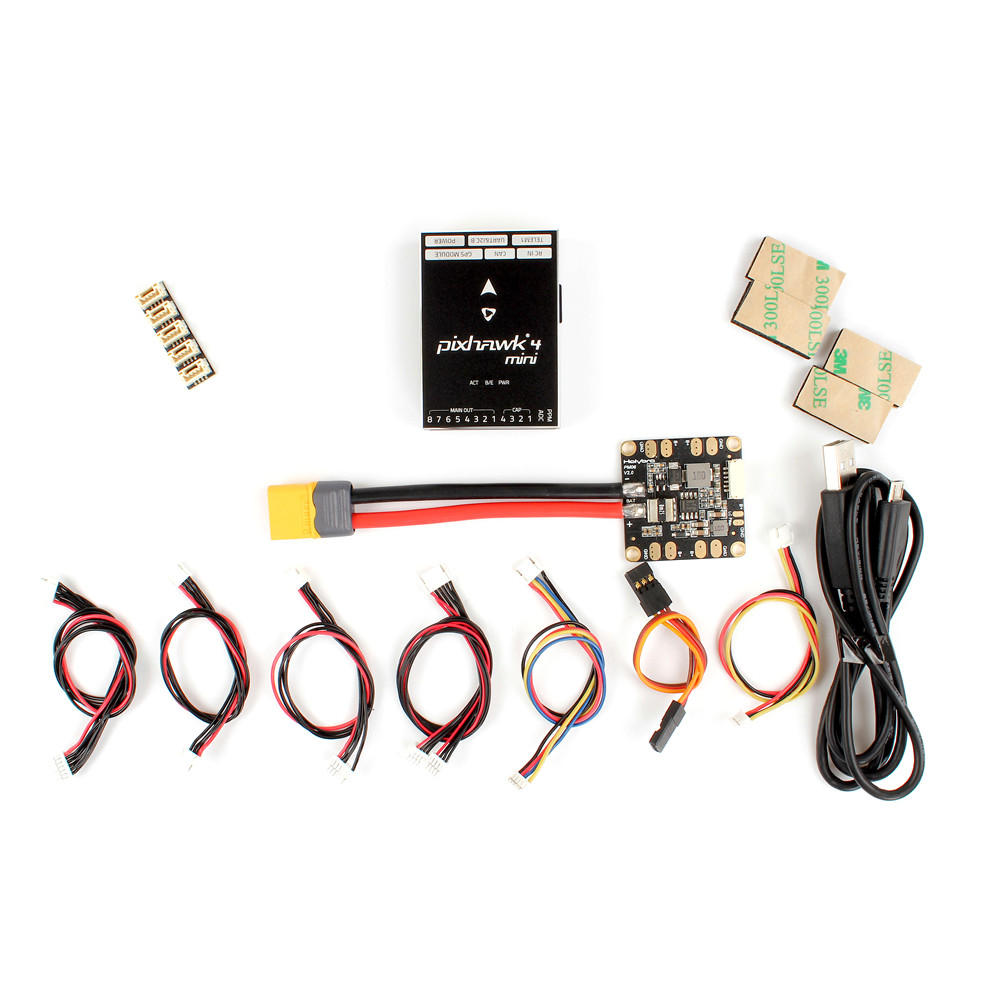
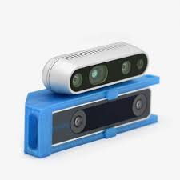
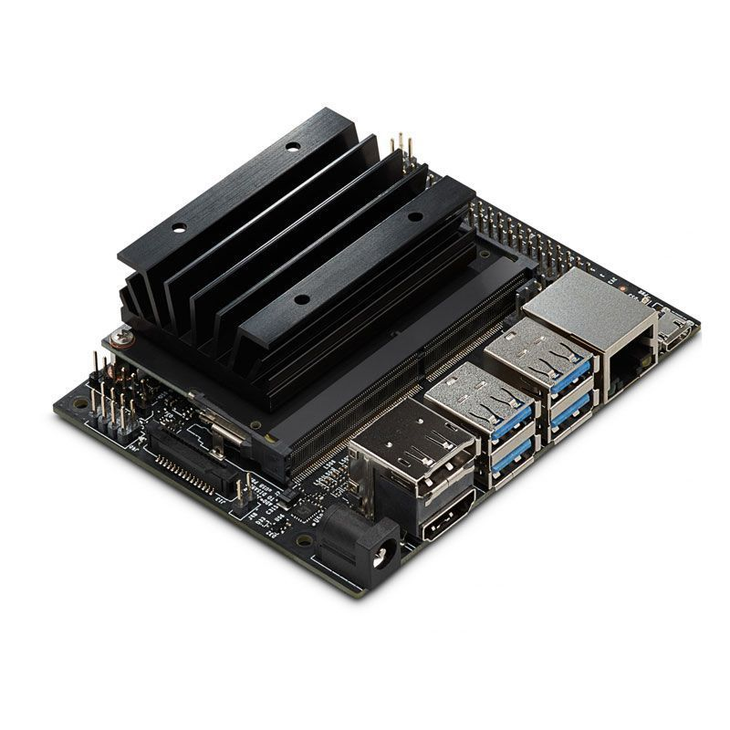
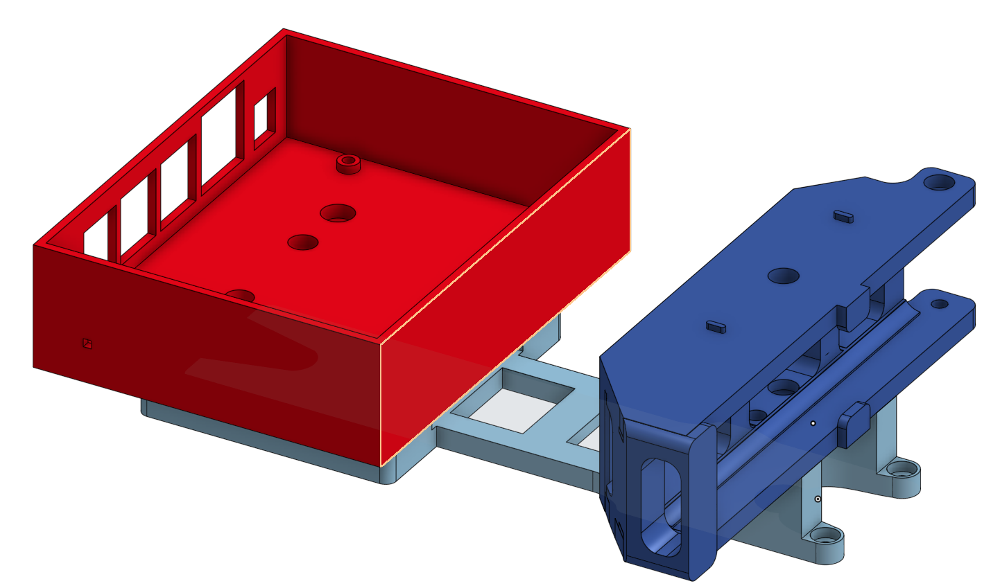
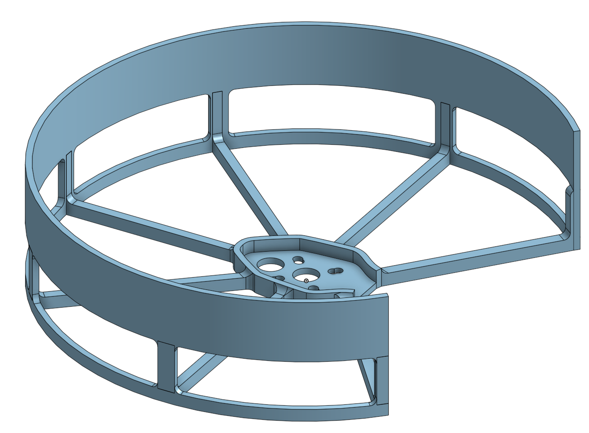

# Robodrone

## Demo
<video controls width="250">
    <source src="img/Meaoodrone-demo.mov" type="video/mp4">
</video>

## 1. Drone build

### 1.1 Parts
Frame : 

Récepteur Frsky XM+ (SBUS) EU LBT : https://www.studiosport.fr/recepteur-frsky-xm-sbus-a13865.html

Motors XNova FS Line 2207 - x4 1700 KV : https://www.studiosport.fr/moteurs-xnova-fs-line-2207-par-4-a17208.html

4 Hélices tripales DALprop TJ6045 Rouge : https://www.studiosport.fr/helices-tripales-dalprop-tj6045-a10781.html

4 ESC AIKON AK 32 35A 6S BLHeli32 : https://www.studiosport.fr/esc-aikon-ak-32-35a-6s-blheli32-a13754.html

Pixhawk 4 mini

Intel realsense T265 & D435

NVIDIA Jetson nano

3D prints :
- core : 
    - STL : [ref](img/Meaoodrone-core.zip)
    - fixings : 
        - d435 : https://www.amazon.fr/gp/product/B07CKZNZRB/ref=ppx_yo_dt_b_asin_title_o04_s00?ie=UTF8&psc=1
        - https://www.amazon.fr/gp/product/B07G1B2BJW/ref=ppx_yo_dt_b_asin_title_o04_s00?ie=UTF8&psc=1
        - https://www.amazon.fr/gp/product/B07RKTMKGR/ref=ppx_yo_dt_b_asin_title_o05_s00?ie=UTF8&psc=1
        - Support silentbloc M3 2x4 : https://www.dronelec.com/c/p/4480-support-silent-bloc-pour-carte-de-vol-m3-5x5mm-x4/null/
- prop guard x4 : 
    - STL : [ref](img/Prop-guard-v3.stl)

### 1.2 Assembly

