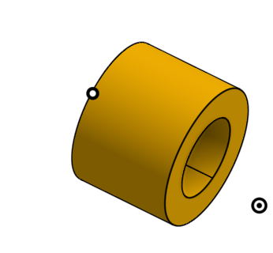

# Robodrone

 

## Summary
The objective of this project is to build an autonomous drone able to follow a path, detect and pass thru gates and complete course.  
Corresponding challenge : https://www.roboracingleague.com/   
Meetup : https://www.meetup.com/fr-FR/DIY-Robocars-France/  
Youtube channel : <a href="https://www.youtube.com/channel/UC7dakUQw-4Dd-6M4JbVFB6w">Link</a>  
Slack team : <a href="https://join.slack.com/t/diyrobocars-france/shared_invite/enQtODU2MDcwNDA0MTI5LTgyYzMzYjlkY2E1YThmMjg4MTk4MjlkMGY3NmExZjA1ZmM2NGQ3ODk3ODNhNmIxNTU5OWM1ZjVjZGY0YmEzODk">Link</a>

This github repo is divided into 2 parts :
- Drone build  : how to mount the drone, see below  
- Brain setup : the software part including the Jetson Nano setup. See in brain directory  
 
 

## 1. Drone build

### 1.1 Parts
<b>Frame : Realacc Martian IV 7 Inch 300mm Wheelbase 4mm Arm Carbon Fiber FPV Racing Frame Kit</b>
  
  

 

<b>Frsky XM+ (SBUS) EU LBT receiver</b> : <a href="https://www.studiosport.fr/recepteur-frsky-xm-sbus-a13865.html">Link</a>

 

<b>4 x Motors XNova FS Line 2207 - 1700 KV</b> : <a href="https://www.studiosport.fr/moteurs-xnova-fs-line-2207-par-4-a17208.html">Link</a>  
 
<b>4 x three-bladed propelers DALprop TJ6045 Red</b> : <a href="https://www.studiosport.fr/helices-tripales-dalprop-tj6045-a10781.html">Link</a>  
 
<b>4 x ESC AIKON AK 32 35A 6S BLHeli32</b> : <a href="https://www.studiosport.fr/esc-aikon-ak-32-35a-6s-blheli32-a13754.html">Link</a>  
 
<b>UBEC : Matek Systems UBEC DUO 4A/5~12V et 4A/5V </b>  
  

 
 
<b>4S LIPO</b> :   

 

<b>Pixhawk 4 mini</b>  

 
 

<b>Radio Controler - Taranis X9D plus</b>  

But other RC cheaper alternatives are ok. Adapt your RC receiver according to your radio

 
<b>Intel realsense T265 & D435</b>  
 

and their cables at the right size : 
- <a href="https://www.amazon.fr/gp/product/B074V3GD2S/ref=ppx_yo_dt_b_asin_title_o03_s00?ie=UTF8&psc=1">Link</a>
- <a href="https://www.amazon.fr/gp/product/B078XS7BLH/ref=ppx_yo_dt_b_asin_title_o03_s01?ie=UTF8&psc=1">Link</a>

 
<b>NVIDIA Jetson nano</b>  
 

Wifi card : <a href="https://www.amazon.fr/Coolwell-Waveshare-Wireless-Bluetooth-Connector/dp/B07VRKKLCM/ref=sr_1_1_sspa?adgrpid=68784494837&gclid=Cj0KCQiApaXxBRDNARIsAGFdaB_16HoOJbIfPt6EMQZydgNM79Muy14XmRAXlzGFa5Wgb1ycQlaB9uEaAkchEALw_wcB&hvadid=342345071428&hvdev=c&hvlocphy=9056245&hvnetw=g&hvpos=1t1&hvqmt=e&hvrand=7547937530900791981&hvtargid=kwd-788762341655&hydadcr=7970_1754970&keywords=jetson+nano+wifi&qid=1579783773&sr=8-1-spons&psc=1&spLa=ZW5jcnlwdGVkUXVhbGlmaWVyPUExSk5SUDA1T1dMQjZVJmVuY3J5cHRlZElkPUEwNTc4MjAxM0lRUDBUQU1HNDFKOCZlbmNyeXB0ZWRBZElkPUEwMDQ0MDM4M0g5NjNSUkZOT1hBOCZ3aWRnZXROYW1lPXNwX2F0ZiZhY3Rpb249Y2xpY2tSZWRpcmVjdCZkb05vdExvZ0NsaWNrPXRydWU=">Link</a>

better with these 2 x molex antena for wifi : <a href="https://www.mouser.fr/ProductDetail/molex/204281-1100/?qs=W0yvOO0ixfHAJETEkFF0dw==&countrycode=DE&currencycode=EUR">Link</a>

Jetson alimentation : <a href="https://www.cdiscount.com/informatique/cables-connectiques/eu-plug-dc-5-5-2-1mm-avec-adaptateur-d-alimentatio/f-1072015-gob0699912974792.html">Link</a>

and to connect the UBEC to the Jetson you will need this kind of connector : <a href="https://www.manomano.fr/adaptateur-et-connecteur-pour-cable-courant-faible-4497?g=1&referer_id=687129&gclid=Cj0KCQiApaXxBRDNARIsAGFdaB_qt3og7H6BETdX6H6wrAyqou4MZxxWeAbGqAycPB3qnYSyTEOnELcaAlIqEALw_wcB&model_id=13761290">Link</a>

 
 

<b>3D prints :</b>
- core : 
    - STL : [ref](img/Meaoodrone-core.zip)
    - fixings : 
        - d435 : <a href="https://www.amazon.fr/gp/product/B07CKZNZRB/ref=ppx_yo_dt_b_asin_title_o04_s00?ie=UTF8&psc=1">Link</a> 
        - <a href="https://www.amazon.fr/gp/product/B07G1B2BJW/ref=ppx_yo_dt_b_asin_title_o04_s00?ie=UTF8&psc=1">Link</a>
        - <a href="https://www.amazon.fr/gp/product/B07RKTMKGR/ref=ppx_yo_dt_b_asin_title_o05_s00?ie=UTF8&psc=1">Link</a>
        - Support silentbloc M3 2x4 : <a href="https://www.dronelec.com/c/p/4480-support-silent-bloc-pour-carte-de-vol-m3-5x5mm-x4/null/">Link</a>
- prop guard x4 : 
    - STL : [ref](img/Prop-guard-v3.stl)

 

### 1.2 Assembly classic parts
#### 1.2.1 Motors and ESC
Mount motors and ESC on each arm and solder the wires. Beware to invert wiring of motor 1 and 2 (they spin counterclockwise).  

  

#### 1.2.2 Powerboard
Mount powerboard delivered with Pixhawk 4 mini. Solder the wires  
Connect powerboard to Pixhawk with connectors provided with Pixhawk

#### 1.2.3 RC receptor
Connect Frsky XM+ to Pixhawk (use connector provided with Pixhawk and solder to Frsky XM+)

#### 1.2.4 QGround Control settings
Connect your computer to Pixhawk (via micro usb)  
Download, install then open QGround Control on your computer  
You should have now QGC connected to your Pixhawk  
PX4 Firmware version used and tested : 1.10.0  

##### Vehicule setup
Airframe : select 3DR DIY QUad  

Sensor setup : follow instructions  

Radio setup : after having connected your RC (see below), check channel 1 to 12 are active 
and that Roll, Pitch, Yaw and Throttle are correct    

Flight mode :   

Power :   

Safety :   

Parameters :  
- EKF2 :
    - EKF2_AID_MASK : 24
    - EKF2_EVP_NOISE : 0.10 m
    - EKF2_HGT_MODE : vision
- GPS : disabled
- MAVLINK :   
- SERIAL : SER_TEL1_BAUD : 921600 8N1
- SYSTEM :   
- Developer :   

#### 1.2.5 Radio Controller settings
Start and set your taranis so that it connects to your Frsky XM+. Tutorial : https://www.youtube.com/watch?v=ZOBwwNpjNrY  
Set your 12 first channel (first 4 for attitude control). See at end of Readme.md in brain directory for some details

#### 1.2.6 Test your config
<b>Without your propelers mounted</b>, connect your 4S battery to your drone and turn on your Taranis.  
Arm your drone (from taranis) and check that motors spin in the right way :  
  

You can then test your drone with propelers but outdoor in safety environnement (with no obstacle 10m around and above) and in stabilized mode. Objective is to check that drone can takeoff (no more than 50cm !), yaw, pitch and roll.   
Be ready anytime to disarm if something goes wrong !  

If it's ok, you can move on to the next step : go to Assembly autonomous parts.

 

### 1.3 Assembly Autonoumous parts

#### 1.3.1 Mount the 3D print Support_frame with 3D print Camera_support

  

inject with your soldering iron the 4x  in the hole of 3Dprint Camera_support  
Add Support silentbloc M3 2x4 and fix the Support_frame with Camera_support with M3 screws  

If you want to mount D435 camera : 
- use screw  and put through 3D print 435_screw_support 
- put it through the 3D Print camera_support  
 Be aware that you won't be able to mount this after having screwed the Support_frame on the quad

Then Mount the 3D print Support_frame and Camera_support on the quad frame.  

Be careful to pass the UBEC and XT60 wires throuh the middle of the frame  
 

Be careful also to put the battery strap on the Support_frame  
 

Screw the Support_frame on your quad only after the UBEC is soldered (se below)  

#### 1.3.2 UBEC 
Solder your UBEC input voltage wires to Battery Pins of the Powerboard.  
Be careful to pass the wires though the middle of the frame

 

Screw (3M) the Support_frame on your quad  

#### 1.3.3 Mount the 3Dprint Jetson_box

inject with your soldering iron the 4x  in the hole of 3Dprint Support_frame  
Add Support silentbloc M3 2x4 and fix the Support_frame with Jetson_box with M3 screws  

#### 1.3.4 Put your Jetson in the Jetson_box

#### 1.3.5 Connect PixHawk to Jetson
Connect TELEM1 port of Pixhawk to GND/RX/TX pins of the Jetson (pins 8, 10 and 12)

#### 1.3.6 Add your t265
Insert your T265 realsense camera to the Camera_support and connect it to one of the Jetson USB port

 

### 1.4 Others various Drone photos

## 