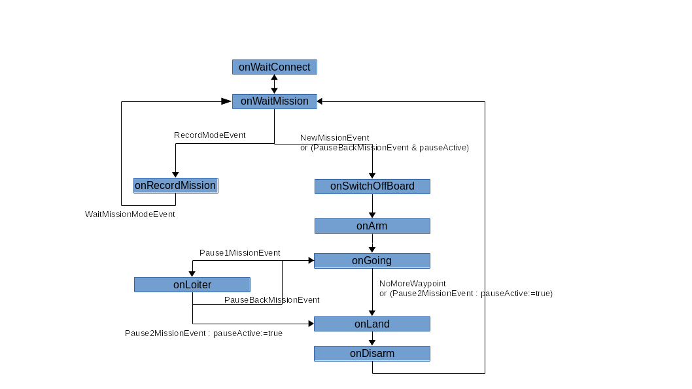

# Brain

## Summary
This part part will explain :
- how to setup your jetson nano and install prerequisites
- how to install the brain
- how to auto or manualy start and stop the meaoodrone environnement (rosmaster, camera ros nodes, brain ros node)
- how to check everything is ok
- how to pilot your drone thru the brain software
  - record a mission path and execute it
  - pause and continue a mission
  - land the drone at any moment

## 1 Jetson setup and prerequisites installation
We recommand to setup your jetson in headless mode. You can follow this tutorial https://www.youtube.com/watch?v=Ch1NKfER0oM  

If after setting up the first time your jetson in headless mode but not be able to access your jetson thru wifi and you want to change your wifi settings, do as following
```sh
screen /dev/usb.modem #for mac
sudo nmcli dev wifi connect (NETWORK) password (PASSWORD) ifname wlan0
```
After this step, you'll be able to access to the jetson thru wifi and ssh


Install Ros Melodic package : http://wiki.ros.org/melodic/Installation/Ubuntu (ros-melodic-ros-base is enough)

Install mavros melodic 
```sh
sudo apt-get install ros-melodic-mavros ros-melodic-mavros-extras
````

Install librealsense : https://github.com/IntelRealSense/librealsense/blob/master/doc/distribution_linux.md or https://www.jetsonhacks.com/2019/05/16/jetson-nano-realsense-depth-camera/  

Install realsense-ros : https://github.com/IntelRealSense/realsense-ros (step 3)


## 2 Brain install

### 2.1 Get source

```sh
cd $HOME 
git clone thisrepo
```


### 2.2 Compile

Create a catkin_env with src/setpoint_leader link to setpoint_leader
```sh
cd $HOME
mkdir -p catkin_ws/src
cd catkin_ws/src
ln -s $HOME/robodrone/brain/setpoint_leader setpoint_leader
```
then compile 
```
cd ..
catkin config --init
catkin_make
source ./devel/setup.bash
```

### 2.3 Setup your env
Add file $HOME/.bashmeaoo with following content
```sh
export GCS_MacAdress="MACAdressOfYourLaptop" #Linux
```  

Add following content to your $HOME/.bashrc
```sh
source $HOME/.bashmeaoo
source $HOME/robodrone/script/init.sh
source $HOME/robodrone/script/meaoodrone.sh
```

## 2.4 Radio Controller setup (taranis X9D-Plus)
Parameter Taranis so that following swithes correspond to the associated channel number, and if QGC specified also parameter QGC accordingly (in flight mode settings)  
Arming (QGC) : SE (channel 12)
- disarmed
- armed
- armed and log activated (pose, velocity, local_raw_pub, attitude_raw_pub) TODO

Flight mode (QGC) : SA (channel 5)
- Position (but often forced by px4 to altitude)
- Stabilized
- Accro

Brain mode : SB (channel 10)
- record mission
- wait mission
- execute last mission recorded

Record waypoint : SF (channel 11)

Emergency kill (QGC) : SD (channel 8) - to use as a last resort (drone will fall)

Record waypoint mode : SC (channel 6) - TODO
- normal
- freestyle 1
- freestyle 2

Switch offBoard/FlightMode : SH (channel 7)
- in offboard mode, switch to manual mode : if done during a mission, the mission is paused
- and vice versa (and mission resumes)

Pause during mission : SG (channel 9)
- pause back
- pause 1 : loiter
- pause 2 : land and disarm - better option than emergency kill

<br>

### 2.3 End2End Test  

<b>IMPORTANT : Do all these tests without propelers mounted !!!</b>

Start your Taranis and connect your drone to the 4S Battery (Lipo)  
Then connect to the jetson thru wifi and ssh   
Then
```sh
$ source $HOME/.bashrc
```

#### 2.3.1 Test rosmaster
```sh
$ rosmaster_start
$ tail -f $LOG_DIR/rosmaster.log
```
Start your QGroundControl on your laptop and you should be connected to the PX4 of the drone  
If not, 2 possibly issues :
- Connexion between Jetson and Pixhawk doesn't work. 
  - Check your wiring between jetson (GND, RX, TX) and Pixhawk (TELEM1)
  - Check your PX4 parameters on Pixhawk : MAVLINK and SERIAL
- Connexion between Jetson and QGC thru ROS doesn't work
  ```sh
  $ ps -ef | grep roslaunch
    dlinano   7490  6455 35 22:44 pts/0    00:00:01 /usr/bin/python /opt/ros/melodic/bin/roslaunch mavros px4.launch fcu_url:=/dev/ttyTHS1:921600 gcs_url:=udp://@192.168.1.48
  ```
  check that IP of gcs_url is the IP of your QGC laptop. If not or empty, check MacAdress input in $HOME/.bashmeaoo

Check on QGC that your taranis is well connected and that 12 channels are actives

#### 2.3.2 Test t265 camera
```sh
$ t265_start
$ tail -f $LOG_DIR/ts_t265.log
```
if ok, last line will be `RealSense Node Is Up!`

Check corresponding ros topic  

Output of the camera :
```sh
$ re /camera/odom/sample
---
header:
  seq: 274680
  stamp:
    secs: 1579641476
    nsecs: 138899803
  frame_id: "camera_odom_frame"
child_frame_id: "camera_pose_frame"
pose:
  pose:
    position:
      x: 0.00738243432716
      y: -0.0018960274756
      z: 0.000934698793571
    orientation:
      x: 0.0104617411271
      y: 0.0024516673293
      z: -0.000406171893701
      w: 0.999942243099
  covariance: [0.1, 0.0, 0.0, 0.0, 0.0, 0.0, 0.0, 0.1, 0.0, 0.0, 0.0, 0.0, 0.0, 0.0, 0.1, 0.0, 0.0, 0.0, 0.0, 0.0, 0.0, 0.001, 0.0, 0.0, 0.0, 0.0, 0.0, 0.0, 0.001, 0.0, 0.0, 0.0, 0.0, 0.0, 0.0, 0.001]
twist:
  twist:
    linear:
      x: 0.00167128749905
      y: -0.00274888776882
      z: 0.00273850766414
    angular:
      x: 0.000817718089133
      y: -0.00286774914567
      z: 0.00204741420022
  covariance: [0.1, 0.0, 0.0, 0.0, 0.0, 0.0, 0.0, 0.1, 0.0, 0.0, 0.0, 0.0, 0.0, 0.0, 0.1, 0.0, 0.0, 0.0, 0.0, 0.0, 0.0, 0.001, 0.0, 0.0, 0.0, 0.0, 0.0, 0.0, 0.001, 0.0, 0.0, 0.0, 0.0, 0.0, 0.0, 0.001]
```

Pose from PX4 thru Mavlink/Mavros
```sh
$ re /mavros/local_position/pose
---
header:
  seq: 45355
  stamp:
    secs: 1579641605
    nsecs: 826453120
  frame_id: "map"
pose:
  position:
    x: 1.99601981876e-05
    y: 0.0076264902018
    z: 0.00339243048802
  orientation:
    x: 0.0144207890422
    y: -0.0146912298727
    z: -0.706569689943
    w: -0.70734403975
---
```
If you move your drone, the position values should evolve accordingly

#### 2.3.1 Test the brain 

```sh
$ brain_start
$ tail -f $LOG_DIR/setpoint_leader.log
[ INFO] [1579642036.974429656]: MAVROS: Pickup position : -0.055077, -0.144000
[ INFO] [1579642036.974479656]: MAVROS: Delivery position : 0.024406, -0.254477
[ INFO] [1579642036.974530386]: State onWaitMission: event NewMissionEvent
[ INFO] [1579642036.974584813]: getNextWaypoint : next waypoint is x=-0.055077 y=-0.144000 z=1.324445, mode=0.000000
[ INFO] [1579642036.974634710]: getNextWaypoint : 7 waypoints remaining
[ INFO] [1579642036.974683720]: State onSwitchOffBoard: entering
[ INFO] [1579642036.974787784]: MAVROS: Request OFFBOARD mode
[ INFO] [1579642036.977907131]: OFFBOARD request sent (1)
[ INFO] [1579642036.994066839]: State onSwitchOffBoard: event WaitMissionModeEvent
[ INFO] [1579642036.994177308]: State onSwitchOffBoard: event PauseBackMissionEvent
[ INFO] [1579642262.024151393]: MissionStateMachine: State created: onWaitConnect
[ INFO] [1579642262.024328163]: MissionStateMachine: State created: onWaitMission
[ INFO] [1579642262.024373320]: MissionStateMachine: State created: onRecordMission
[ INFO] [1579642262.024454153]: MissionStateMachine: State created: onSwitchOffBoard
[ INFO] [1579642262.024498684]: MissionStateMachine: State created: onArm
[ INFO] [1579642262.024547278]: MissionStateMachine: State created: onStopOffBoard
[ INFO] [1579642262.024590143]: MissionStateMachine: State created: onGoing
[ INFO] [1579642262.024629101]: MissionStateMachine: State created: onDisarm
[ INFO] [1579642262.024665820]: MissionStateMachine: State created: onLoiter
[ INFO] [1579642262.024706861]: MissionStateMachine: State created: onLand
[ INFO] [1579642262.024743268]: MissionStateMachine: State created: onFreestyle
[ INFO] [1579642262.038879986]: updateParam : new mission_recorded_filename set to /home/dlinano/robodrone/script/../mission_recorded/mission-recorded.mission
[ INFO] [1579642262.041715247]: updateParam : new mission_script set to /home/dlinano/robodrone/script/../brain/scripts/mission.sh
[ INFO] [1579642262.103044413]: State onWaitConnect: entering
[ INFO] [1579642262.323508997]: State onWaitConnect: event ConnectedEvent
[ INFO] [1579642262.323616653]: State onWaitMission: entering
[ INFO] [1579642262.323679101]: state onWaitMission : pauseActive = false
[ INFO] [1579642262.323824465]: state onWaitMission : destX:0.000000, destY:0.000000, destZ:0.000000
[ INFO] [1579642262.343446080]: State onWaitMission: event PauseBackMissionEvent
```

## 3 Auto start at boot 

```sh
$ sudo cp $HOME/robodrone/script/etc/systemd/system/meaoodrone.service /etc/systemd/system/.
$ sudo chmod 664 /etc/systemd/system/meaoodrone.service
$ sudo systemctl daemon-reload
$ sudo systemctl enable meaoodrone
```


## 14.1 Send mission manually :

```sh
rostopic pub /robocar/mission setpoint_leader/robocars_mission  "
departure:
  frame: 4
  command: 16
  is_current: true
  autocontinue: true
  param1: 0.0
  param2: 0.0
  param3: 0.0
  param4: 0.0
  x_lat:  150.0
  y_long: 300.0
  z_alt: 0.0
arrival:
  frame: 4
  command: 16
  is_current: true
  autocontinue: true
  param1: 0.0
  param2: 0.0
  param3: 0.0
  param4: 0.0
  x_lat:  0.0
  y_long: 150.0
  z_alt: 0.0
path:
    - frame: 4
      command: 16
      is_current: true
      autocontinue: true
      param1: 0.0
      param2: 0.0
      param3: 0.0
      param4: 0.0
      x_lat:  150.0
      y_long: 300.0
      z_alt: 0.0
    - frame: 4
      command: 16
      is_current: true
      autocontinue: true
      param1: 0.0
      param2: 0.0
      param3: 0.0
      param4: 0.0
      x_lat:  100.0
      y_long: 250.0
      z_alt: 0.0
    - frame: 4
      command: 16
      is_current: true
      autocontinue: true
      param1: 0.0
      param2: 0.0
      param3: 0.0
      param4: 0.0
      x_lat:  50.0
      y_long: 200.0
      z_alt: 0.0
    - frame: 4
      command: 16
      is_current: true
      autocontinue: true
      param1: 0.0
      param2: 0.0
      param3: 0.0
      param4: 0.0
      x_lat:  0.0
      y_long: 150.0
      z_alt: 0.0"
```
or from a file : 
```sh
./script/mission.sh filename
```

## 14.2 Mission recording
To record a mission from the drone, you need to configure your RC (associate channels to buttons) as following :
- channel 10 : for mode switching between onRecordMission mode and onWaitMission mode 
  - Without this channel active, default mode is onWaitMission
  - switching to onRecordMission activates channel 11 listening and start a new mission recording. When you switch back to onWaitMission mode, the mission recorded is saved in a file named <span style="color:red">**mission-recorded_*timestamp*.mission**</span> in the directory where you launch the brain
- channel 11 : to record a position, switch this channel

## 14.3 Brain State diagram



## 16 change thresh to detect checkpoint/
```sh
rosparam set dst_thresh 0.2
```


## 21 RC setup (taranis X9D-Plus)
Arming : SE (channel 12)
- disarmed
- armed
- armed and log activated (pose, velocity, local_raw_pub, attitude_raw_pub) TODO

Flight mode : SA (channel 5)
- Position (but often forced by px4 to altitude)
- Stabilized
- Accro

Brain mode : SB (channel 10)
- record mission
- wait mission
- execute last mission recorded

Record waypoint : SF (channel 11)

Emergency kill : SD (channel 8) - to use as a last resort (drone will fall)

Record waypoint mode : SC (channel 6) - TODO
- normal
- freestyle 1
- freestyle 2

Switch offBoard/FlightMode : SH (channel 7)
- in offboard mode, switch to manual mode : if done during a mission, the mission is paused
- and vice versa (and mission resumes)

Pause during mission : SG (channel 9)
- pause back
- pause 1 : loiter
- pause 2 : land and disarm - better option than emergency kill